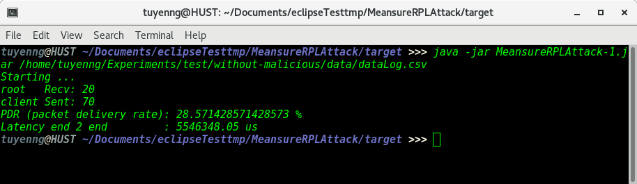

# Meansure PDR and Latency for RPL-attacks project

## Require

- JDK 8
- Dataset format `time, idNode, msg, idClient` and root node equal id 0. E.g: `81192393,8,DATA: Hello 5 from the client`

## Setup

```
# Clone
$ git clone --branch rpl-attacks https://github.com/giatuyentiensinh/StatisticLatency.git
# Build
$ mvn clean package
# Run
$ cd target
$ java -jar MeansureRPLAttack-1.jar <data_set.csv>
```

* Node: 

- File `script.js` in folder `rpl-attacks/templates/experiment` should be

```js

// since OpenJDK 8, Rhino JS Engine is replaced by Nashorn
// this line provides compatibility so that 'importPackage' can be used
try { load("nashorn:mozilla_compat.js"); } catch(e) {}
importPackage(java.io);

// get plugin instances
visualizer = mote.getSimulation().getCooja().getStartedPlugin("VisualizerScreenshot");
powertracker = mote.getSimulation().getCooja().getStartedPlugin("PowerTracker");

// create log file handlers
log.log("Opening log file writers...\n");
log_serial = new FileWriter("./data/serial.log");                // open serial log file
log_rpl = new FileWriter("./data/rpl.log");                      // open RPL messages log file
log_relationships = new FileWriter("./data/relationships.log");  // open mote relationships log file
log_power = new FileWriter("./data/powertracker.log");           // open power tracker logfile
log_data = new FileWriter("./data/dataLog.csv");

// re-frame visualizer view
visualizer.resetViewport = 1;
visualizer.repaint();

// set timeout and declare variables
TIMEOUT({{ timeout }}, log.testOK());
var c = 0, i = 1, period = {{ sampling_period }}, screenshot = false, pad = "00000", nbr = "";

// now, start the test
log.log("Starting stript...\n");
visualizer.takeScreenshot("./data/network_" + pad + ".png", 0, 0);
while(1) {
  try {
    // first, log to serial file
    line = time + "\tID:" + id.toString() + "\t" + msg + "\n"
    if (msg.startsWith("#L ")) {
      log_relationships.write(line);
      log_relationships.flush();
      screenshot = true;
    } else if (msg.startsWith("RPL: ")) {
      log_rpl.write(line);
      log_rpl.flush();
    } else if (msg.startsWith("DATA: ")) {
      line = time +"," + id.toString() + "," + msg + "\n"
      log_data.write(line);
      log_data.flush();
    } else {
      log_serial.write(line);
      log_serial.flush();
    }
    YIELD();
    // then, log power statistics
    if (c < time) {
      log_power.write(powertracker.radioStatistics());
      log_power.flush();
      if (screenshot) {
        nbr = "" + i;
        nbr = pad.substring(0, pad.length - nbr.length) + nbr;
        visualizer.takeScreenshot("./data/network_" + nbr + ".png", 0, 0);
        i += 1;
      }
      c += period;
    }
  } catch (e) {
    log_data.close();
    log_serial.close();
    log_rpl.close();
    log_relationships.close();
    log_power.close();
    log.log("File writers closed\n");
    if (c == 0) { log.testFailed(); } else { break; }
    break;
  }
}
log.log("Done.");

``` 

- Function `timeout_handler` of file `sensor-echo.c` in folder `rpl-attacks/templates/experiment/motes` should be 

```c

 static void
 timeout_handler(void)
 {
   static int seq_id;
   char buf[MAX_PAYLOAD_LEN];
 
   printf("Client sending to: ");
   PRINT6ADDR(&srvipaddr);
   sprintf(buf, "Hello %d from the client %s", ++seq_id, &client_conn->ripaddr);
   // printf(" (msg: %s)\n", buf);
   printf("\nDATA: %s\n", buf);
   uip_udp_packet_sendto(client_conn, buf, strlen(buf),
                        &srvipaddr, UIP_HTONS(3000));
 }
```

- Function `tcpip_handler` of file `root-echo.c` in folder `rpl-attacks/templates/experiment/motes` should be
 
```c

static void
tcpip_handler(void)
{
  static int seq_id;
  char buf[MAX_PAYLOAD_LEN];
  if(uip_newdata()) {
     ((char *)uip_appdata)[uip_datalen()] = 0;
     PRINTF("\nDATA: %s,%d\n", (char *)uip_appdata, UDP_IP_BUF->srcipaddr.u8[sizeof(UDP_IP_BUF->srcipaddr.u8) - 1]);
     PRINTF("Server received: '%s' from ", (char *)uip_appdata);
     PRINT6ADDR(&UDP_IP_BUF->srcipaddr);
     PRINTF("\n");
     uip_ipaddr_copy(&server_conn->ripaddr, &UDP_IP_BUF->srcipaddr);
     server_conn->rport = UDP_IP_BUF->srcport;
     PRINTF("Responding with message: ");
     sprintf(buf, "Reply - (%d)", ++seq_id);
     PRINTF("%s\n", buf);
     uip_udp_packet_send(server_conn, buf, strlen(buf));
     /* Restore server connection to allow data from any node */
     memset(&server_conn->ripaddr, 0, sizeof(server_conn->ripaddr));
     server_conn->rport = 0;
  }
}
``` 

- File `experiments.json` in folder `rpl-attacks/templates` should be 

```
/*

Available Building Blocks :
{{ available_building_blocks }}

Available Root mote types :
{{ available_root_mote_types }}

Available Sensor mote types :
{{ available_sensor_mote_types }}

Available Malicious mote types :
{{ available_malicious_mote_types }}

 */

{
  /*
   All simulations will have the same topology with 10 motes of platform Z1, spread in an square of {{ area_side }}m side, with
    a communication range of {{ tx_range }}m and will last 120 seconds.
   */
  "BASE": {
    "simulation": {
      "number-motes": 10,
      "target": "z1",
      "duration": 120,
      "wsn-generation-algorithm": "quadrants"
    }
  },
  "test": {
    "simulation": {
      "title": "Test simulation",
      "goal": "Create a new simulation",
      "root": "echo",
      "sensor": "echo"
    },
    "malicious": {
      "type": "sensor",
      "building-blocks": [
        "hello-flood"
      ]
    }
  }
}
```

* Result



## Ref

- [RPL attacks framework](https://github.com/dhondta/rpl-attacks)

# Auth: Tuyenng